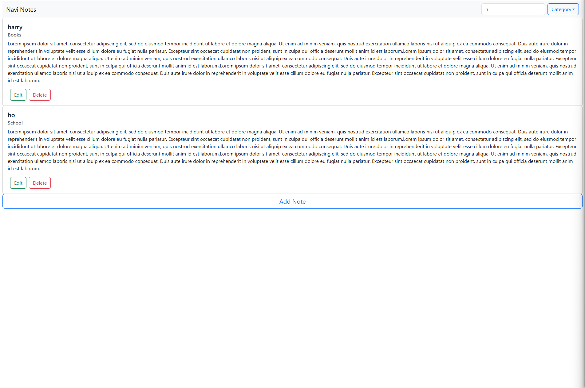

# Note App

A simple Note-taking app built with React that allows users to create, edit, filter, search, categorize, and delete notes.

## Features

- **Create Notes**: Add a new note with a title, category, and content.
- **Search and Filter**: Search for notes by title and filter them by category.
- **Edit Notes**: Edit the title, content, and category of existing notes.
- **Delete Notes**: Remove notes from your list.
- **Categories**: Organize your notes by specific categories (e.g., Work, School, Books, etc.).

## Technologies Used

- **React**: For building the user interface.
- **CSS**: For styling the app.
- **useState & useEffect**: React hooks for managing state and side-effects.

## Installation

### Prerequisites

Make sure you have [Node.js](https://nodejs.org/) installed.

1. Clone this repository:

    ```bash
   git clone https://github.com/yourusername/note-app.git
   ```

2. Navigate to the project directory:

   ```bash
   cd note-app
   ```

3. Install dependencies:

   ```bash
   npm install
   ```
4. Start the development server:

   ```bash
   npm run server
   ```
4. Start the development server:

   ```bash
   npm run dev
   ```

   The app will be available at `http://localhost:5173`.

## How to Use

- **Create a Note**: Click the button to open the create note form, enter the title, category, and content, then save it.

- **Search Notes**: Use the search bar to filter notes by title (it matches from the beginning of the title).

- **Filter Notes by Category**: Select a category from the dropdown to filter notes by their category.

- **Edit Notes**: Click the edit button to modify a note's title, content, or category.

- **Delete Notes**: Click the delete button to remove a note from the list.

## Folder Structure

```
/note-app
  /src
    /components
      NoteList.jsx              # Displays the list of notes
      NoteShow.jsx              # Displays each individual note
      CreateNote.jsx            # Form for creating new notes
      NavBar.jsx                # Navigation and search bar
      CategoriesDropDown.jsx    # Select category dropdown
    App.jsx                     # Main app component, manages state and logic
    main.jsx                   # Entry point, renders the app
    styles.css                 # Global styles
```
